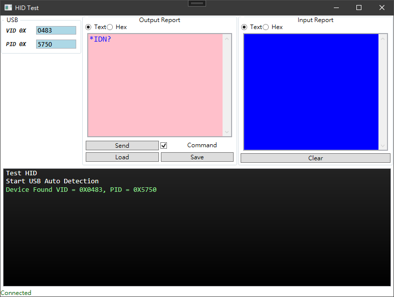

# Hid Test

Copyright © Bill Wang 

All rights reserved.



## Requirements

### 📦 NuGet Packages

- HIDSharp
- [CommunityToolkit.Mvvm for MVVM ViewModel Binding](https://github.com/CommunityToolkit/MVVM-Samples)

### 📬 IDE

- Visual Studio 2022
- .net 6.0


## 🙌 Getting Started

### Initialize Hid Device

```csharp
MyHidClass myHidDevice;
myHidDevice = new MyHidClass(TestSetting.UsbVid, TestSetting.UsbPid);
```

### Add USB Plug/Unplug Event

```csharp
MyHidClass.localDeviceList.Changed += DeviceListChangedHandler;

// Deal with the USB plug & unplug
void DeviceListChangedHandler(object? sender, EventArgs e)
{        
    myHidDevice.CheckHidDevice();

    if (myHidDevice.hidDevice == null)
    {
        DeviceRemoved();
    }
    else
    {
        DeviceConnected();
    }
}
```

### Add HID Input Report Callback

```csharp
myHidDevice.InputReportReceived = InputReportReceived;

// Parse the HID Input Report
void InputReportReceived(byte[] bytes, int length)
{
    // Decode bytes
}
```

### Check USB at startup

```csharp
DeviceListChangedHandler(null, null); // Check USB
```

### Complete Example

```csharp
MyHidClass myHidDevice;
myHidDevice = new MyHidClass(TestSetting.UsbVid, TestSetting.UsbPid);
myHidDevice.InputReportReceived = InputReportReceived;
MyHidClass.localDeviceList.Changed += DeviceListChangedHandler;
DeviceListChangedHandler(null, null); // Check USB

// Parse the HID Input Report
void InputReportReceived(byte[] bytes, int length)
{
    // Decode bytes
}

// Deal with the USB plug & unplug
void DeviceListChangedHandler(object? sender, EventArgs e)
{        
    myHidDevice.CheckHidDevice();

    if (myHidDevice.hidDevice == null)
    {
        DeviceRemoved();
    }
    else
    {
        DeviceConnected();
    }
}
```

## Write to HID

### Send string to HID

``` csharp
public async Task WriteStringAsync(string command)
````

### Send byte array to HID

```csharp
async Task WriteBytesAsync(byte[] buffer, int timeout = 1)
```

## References

- [Community Toolkit 8.0! MVVM Introduction](https://devblogs.microsoft.com/dotnet/announcing-the-dotnet-community-toolkit-800/)
- [Microsoft.Xaml.Behaviors.Wpf](https://github.com/Microsoft/XamlBehaviorsWpf/wiki)